Semantic Segmentation using FCN and UNet models, done as a part of Assignment 4 of the Computer Vision course (IIIT-Hyderabad, Spring '25). The assignment details can be found in the [assignment document](./docs/CV_S25_A4.pdf).

## Results

### FCN


#### Visualisations

_Each image has three columns, representing input image, ground truth, followed by prediction (each image is a collage of these three in that order)._

| Backbone type | 32s                                                       | 16s                                                       | 8s                                                       |
| ------------- | --------------------------------------------------------- | --------------------------------------------------------- | -------------------------------------------------------- |
| Frozen        | 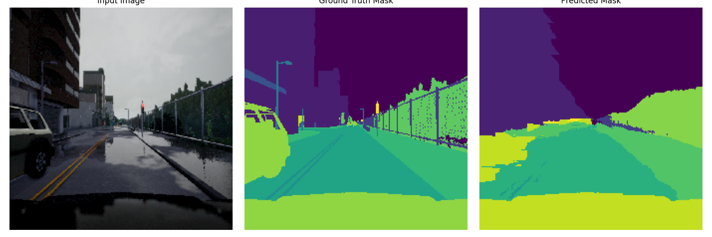   | 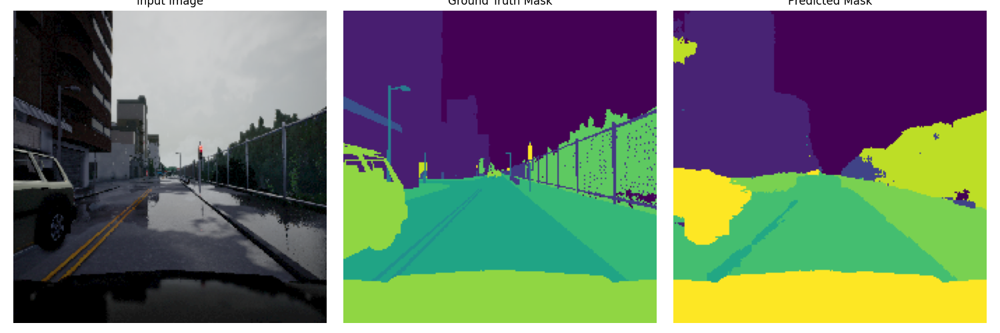   | 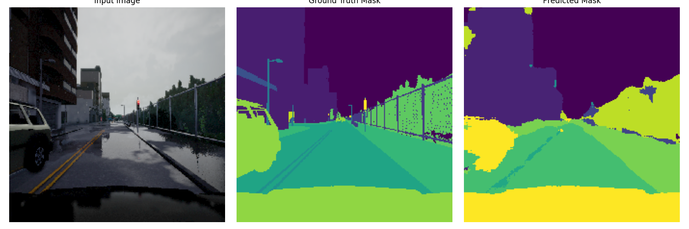   |
| Unfrozen      | 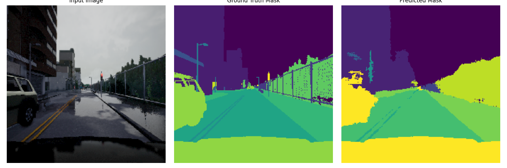 | 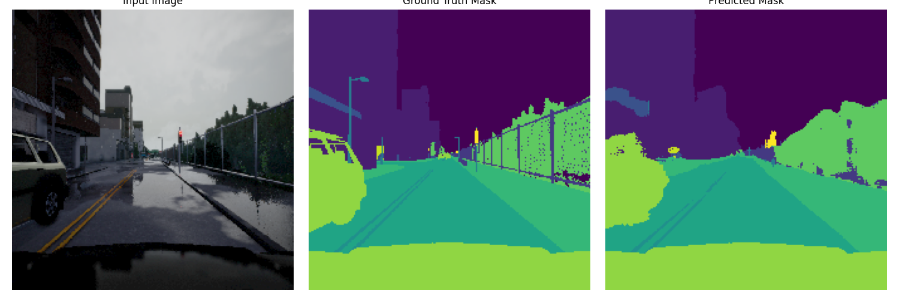 |  |

To train and test the model, run:

```bash
cd FCN
python -m src.main <options>
```

The options include the data directory, batch size, model variant, frozen vs unfrozen backbone, the number of epochs, and the learning rate. See the [`main.py`](./FCN/src/main.py) file for more details.

To visualise some test results on a checkpoint, run:

```bash
cd FCN
./visualise.sh
```

### UNet


#### Visualisations

_Each image has three columns, representing input image, ground truth, followed by prediction (each image is a collage of these three in that order)._

| Variant         | Prediction 1                                            | Prediction 2                                            |
| --------------- | ------------------------------------------------------- | ------------------------------------------------------- |
| Vanilla         | 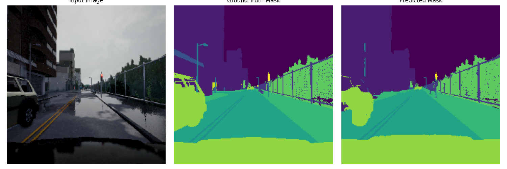  | 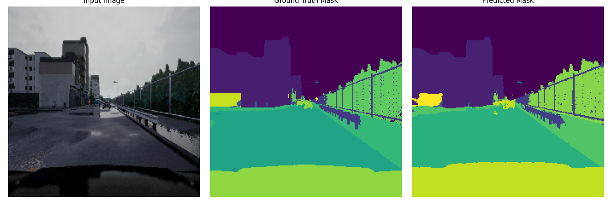  |
| Residual        | 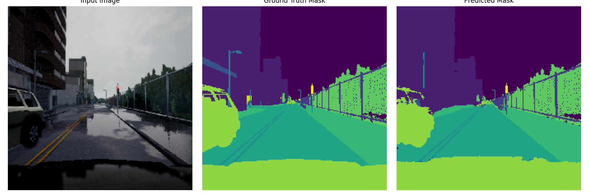 | 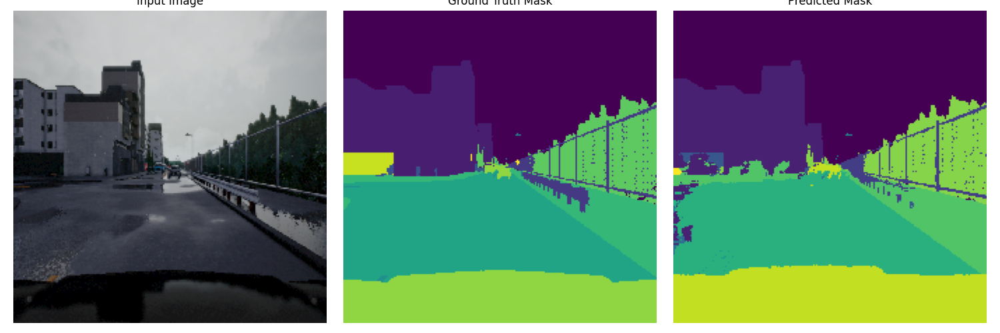 |
| No-Skip         |    | 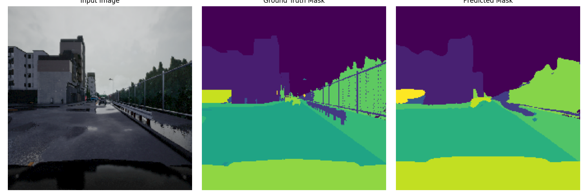   |
| Gated Attention |        | 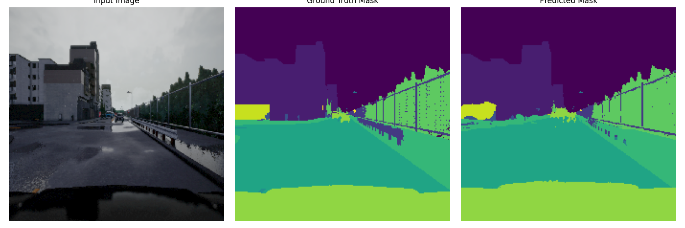       |

To train and test the model, run:

```bash
cd UNet
python -m src.main <options>
```

The options include the data directory, batch size, model variant, the number of epochs, and the learning rate. See the [`main.py`](./UNet/src/main.py) file for more details.

To visualise some test results on a checkpoint, run:

```bash
cd UNet
./visualise.sh
```

## Setup

Download the data from [the following link](https://drive.google.com/drive/folders/1s2ZgwawnZyZXc5eei5cWmgV2A7UXOrMV?usp=sharing).

The environment can be set up with the conda env file:

```bash
cd docs
conda env create -f env.yml
```

or

```bash
pip install -r requirements.txt
```

Alternatively, install the dependencies as in [the conda history](./docs/env-hist.yml).

### Scripts

Helper utilities are available to split the train data [into train and validation](./FCN/scripts/split.py) for the FCN, and [for the UNet](./UNet/scripts/split.py), as well as to perform some [exploratory data analysis](./FCN/scripts/eda.py) for the FCN.
